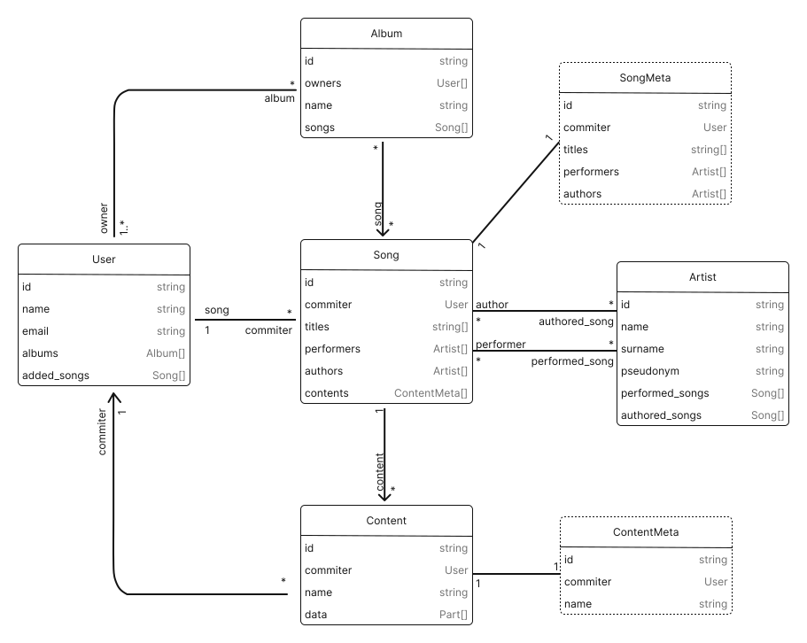

# Data Structure
There are few basic data types used in system. There are depicted in diagram below:
<picture>
  <source media="prefers-color-scheme: dark" srcset="./assets/system-dark.svg">
  
</picture>
